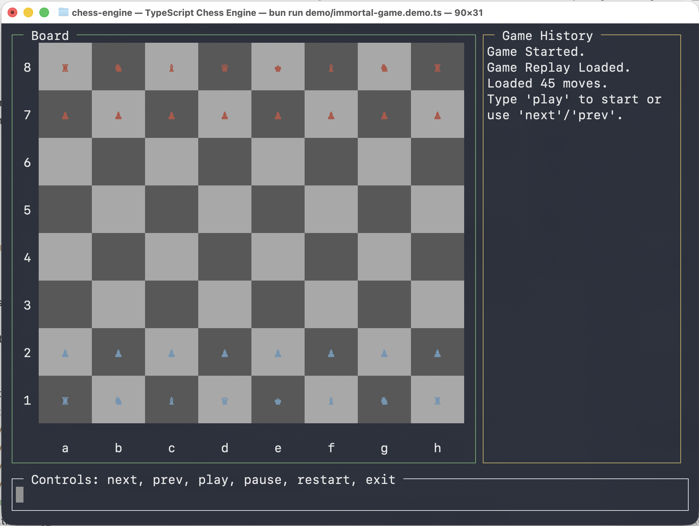
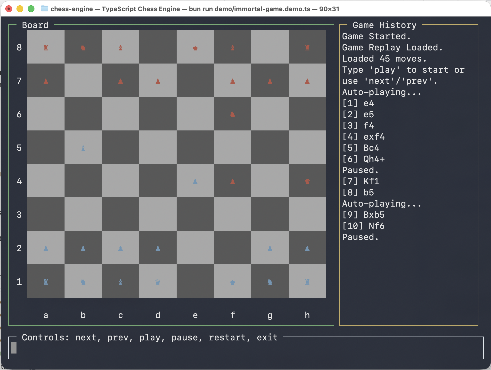
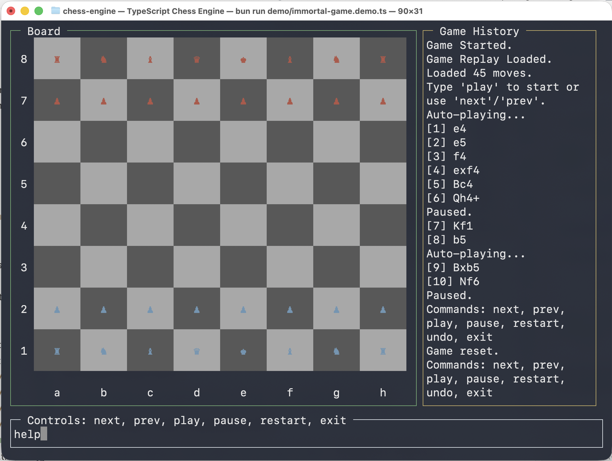

# Chess Engine (TypeScript/Bun)

A flexible, open-source chess engine written in TypeScript for the Bun runtime. Features a modular architecture supporting custom board sizes, personality-driven AI opponents, and a terminal-based UI.

## Features

### Core Engine
- **Flexible Board System**: Support for any board dimensions (e.g., 5x5, 10x10), not just standard 8x8.
- **Bit-Packed Representation**: Efficient memory usage for board tiles.
- **FEN Support**: Full import/export of game states using Forsyth–Edwards Notation.
- **Robust Move Validation**:
    - Legal moves for all standard pieces (Pawn, Knight, Bishop, Rook, Queen, King).
    - En Passant capture.
    - Pawn promotion.
    - **Safe Castling**: Correctly prevents castling through check, out of check, or into check.
    - **Strict Pawn Rules**: Double moves are only allowed from the starting rank.

### AI & Personality
- **Persona System**: AI opponents with "Big Five" personality traits (Openness, Conscientiousness, Extraversion, Agreeableness, Neuroticism).
- **Stockfish Integration** (Experimental): Wraps `stockfish.js` to provide strong chess moves.
- **Game Modes**:
    - **Interactive**: Play against the engine in your terminal.
    - **Demo/Replay**: Watch historical games (e.g., "The Immortal Game").
    - **Minigames**: "Promotion" scenarios.

## Gallery





## Limitations

### Stockfish Dependencies
The `StockfishWorker` relies on specific file paths within `node_modules`.
- It looks for `stockfish-nnue-16-single.js` or `stockfish-17.1-lite...`.
- If these files are missing (e.g., due to package version differences), the AI will fail to initialize.
- The worker uses runtime patching to bypass `worker_threads` checks in Bun. This is fragile.

## Installation

```bash
bun install
```

## Library Quick Start

Use the engine programmatically in your own TypeScript projects.

### 1. Creating a Board programmatically

You can create boards from simple 2D arrays using `ChessBoard.fromGrid`:

```typescript
import { ChessBoard } from './src/chess-board';
import { PieceType } from './src/piece-type.enums';

// Create a 3x3 mini-board
const board = ChessBoard.fromGrid([
    [PieceType.Rook, PieceType.King, PieceType.Rook], // Rank 0 (Top)
    [PieceType.Pawn, PieceType.Pawn, PieceType.Pawn], // Rank 1
    [null,           null,           null          ]  // Rank 2 (Empty)
]);

// Or custom objects with owners
const gameBoard = ChessBoard.fromGrid([
    [{ piece: PieceType.King, owner: 2 }, null],
    [null, { piece: PieceType.King, owner: 1 }]
]);
```

### 2. Validating Moves

```typescript
import { ChessEngine } from './src/chess-engine';

// Initialize Game State
const state = ChessEngine.newGame(board, [
    { team_identifier: 1, player_identifiers: [1] }, // White
    { team_identifier: 2, player_identifiers: [2] }  // Black
]);

// Check if a move is valid (from 0,0 to 0,2)
const isValid = ChessEngine.isValidMove(state, 0, 0, 0, 2);

if (isValid) {
    const newState = ChessEngine.applyMove(state, { 
        fromX: 0, fromY: 0, 
        toX: 0, toY: 2 
    });
}
```

## Usage Guide

### 1. Interactive Play

Start a game against the engine in your terminal. You can choose to play as White or Black.

```bash
bun run src/app/interactive-game.ts
```
*Controls*:
- Type moves in SAN format (e.g., `e4`, `Nf3`, `O-O`).
- Type `undo` to revert a move.
- Type `exit` to quit.

### 2. AI Demonstrations

Watch AI personalities battle or play against a specific personality.

**Play against a Random AI**:
```bash
bun run demo/ai-game.demo.ts chaotic
```
*Personalities*:
- `aggressive`: Prioritizes attacks.
- `cautious`: plays defensively.
- `chaotic`: Unpredictable moves.
- `balanced`: Standard play.

### 3. Historical Replays

Watch the engine replay famous games move-by-move.

```bash
bun run demo/immortal-game.demo.ts
```
*Controls*: Press Enter to step through moves.

### 4. Running Tests

The project includes a comprehensive test suite verifying the engine's compliance with chess rules.

```bash
bun test
```

## Architecture

- `src/chess-board.ts`: Underlying 1D byte-array grid storage.
- `src/chess-engine.ts`: Stateless pure functions for move logic (`isValidMove`, `applyMove`).
- `src/chess-notation.ts`: Parser for Standard Algebraic Notation.
- `src/persona/`: Logic for AI personalities and Stockfish interface.

## Contributing

I am looking for help! Please check the `tests` folder to see how to add new scenarios.

( *Documentation created with AI* )